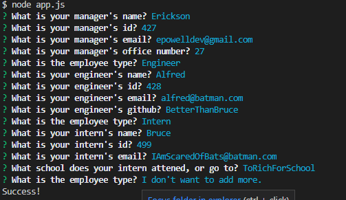
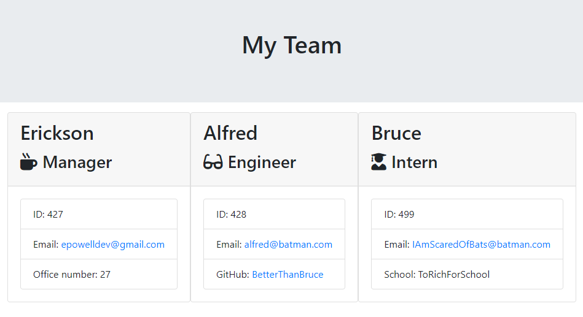

# Employee Summary Generator
## u10-employee-summery

## Description
This is a node console application where you will answer a series of questions about your team/employees so that it will then generate an HTML page of the vital information about them.

## Installation

1. Download the .zip from the green code button on the [GitHub Repo](https://github.com/epowelldev/u10-employee-summary) page.
2. Unzip the file and open that folder with VS Code.
3. Make sure to be inside the folder, open that root directiory in terminal inside of VS Code.
4. Type `npm i` in the terminal to install the application.
5. Type `node app.js` to run the application.
6. Follow the prompts to completion, and the HTML file will output into the "outputs" folder inside the root directory.

## Example Output

### Links

No Deployed application for this assignment, follow [Installation] instructions to use.

[GitHub Repo](https://github.com/epowelldev/u10-employee-summary)